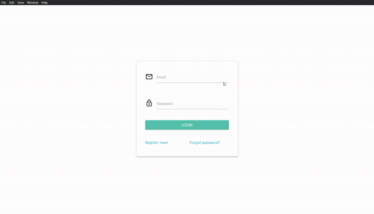

# TWITTER LITE APP
Application developed for the course Application Integration.
Developed in **node.js**, **electron** and views designed using the library **Materialize**.

**There are 3 implementations:**
- Using a **NoSQL MongoDB** database.
- Using a **Rest service**.
- Using **Docker** and implementing **Microservices**
 - 2 microservices: users and tweets.

# Libraries
- electron
- mongodb
- materialize

## Build setup
npm init
npm install

Go inside project directory to execute the following command in order to
run the app:

**npx electron .**

## Run Rest impl
It has to run the express http server first:

**node server.js**

# Refs
https://materializecss.com/getting-started.html

https://www.mongodb.com/try/download/community
